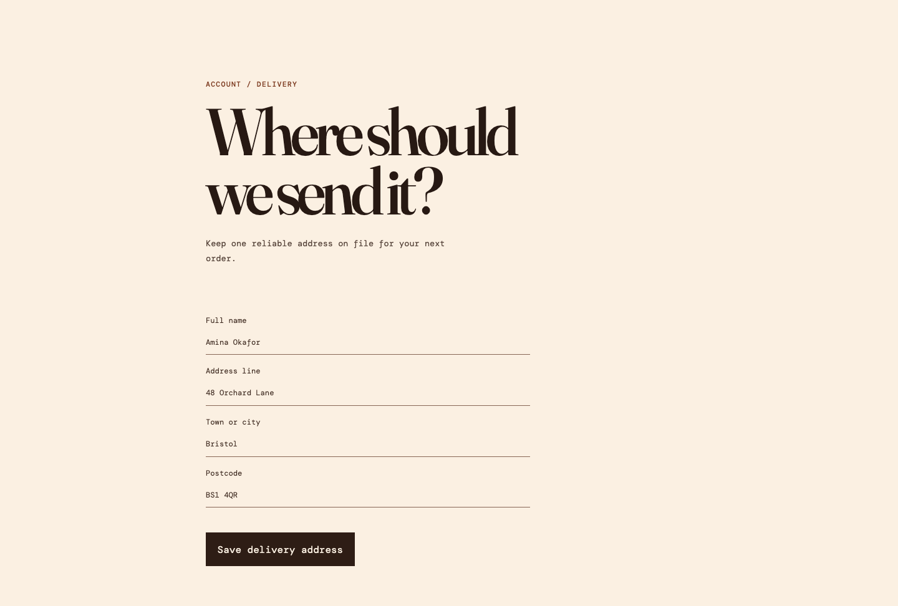

# Journey-first frontend review POC

A React, Webpack and Playwright proof of concept for risk-based frontend delivery. It makes the RFC operational with observable browser journeys, transparent path-based review routing, visual and accessibility checks, and advisory runtime reachability reporting.

## Interface preview



## Local use

```sh
npm install
npx playwright install chromium
npm run start
npm run test:journeys
```

Use `npm run classify-pr -- --base main` to inspect a diff's review lane. Run `npm run reachability` to execute the full browser suite against the instrumented build and write `.artifacts/product-reachability.md`.

## Policy model

- `config/risk-policy.yml` defines sensitive paths and low-risk limits.
- `config/test-impact-map.yml` maps source areas to Playwright tags.
- `config/stale-code-allowlist.yml` records deliberately rare behavior with a reason.
- `.github/workflows/pr-checks.yml` runs deterministic gates before routing a PR.

A low-risk behavioral change is only an auto-merge candidate when it changes a single mapped feature area within configured size limits, includes Playwright evidence, avoids sensitive paths, and every required deterministic check passes. Actual auto-merge additionally requires an explicit `auto-merge-requested` PR label.

The reachability report is an investigation queue. It never deletes code or treats a coverage percentage as a quality target.
